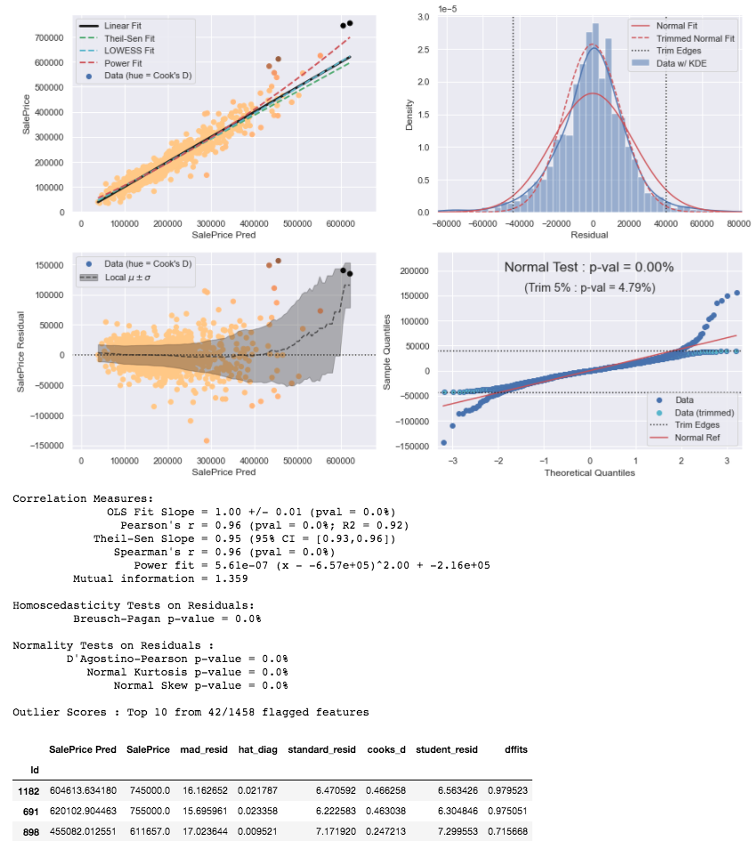

# Overview

This collection of notebooks shows the building of a regression model to predict the sale price of houses in Ames, Iowa.
The goal of this project has been to deepen my experience with the python tools used in
* Handling continuous, discrete, ordinal, and categorical data types
  * Correlation measures between all data type combinations
  * Imputation of missing values
  * Encoding categorical data types (e.g. one-hot, contrast, binary, target)
* Building regression models with SciKit-Learn : Linear regreesion, GLM, Decision Tree, BDT, kNN, and multi-layer perceptron NN
* Statistical analysis with SciKit-Learn, SciPy, Statsmodels, and Pingouin
* Automated approaches to feature selection and model building (e.g. forward stepwise selection, recursive feature elimination)
* Outlier detection

# Current model evaluation
Training data 5-fold CV results of OLS linear regression model using 14 features (8 Categorical, 6 Numerical):
* RMSE : $23000 +/- 2000
* MSLE : 0.017 +/- 0.002
* RMSLE : 0.131 +/- 0.009
* MAPE : 9.4% +/- 0.4%

# Project files
* [AmesHousingEDA](AmesHousingEDA.ipynb) - Exploratory data analysis and tuning of the final model
* [AmesHousingPriceRegression](AmesHousingPriceRegression.ipynb) - The final self-contained pipeline (_forthcoming_)
* [utilities](utilities.py) - Utility functions for EDA and other data analysis tasks
* [test_utilities](test_utilities.ipynb) - Unit tests and examples of the utility functions

# The Data
This is the [Kaggle release](https://www.kaggle.com/c/house-prices-advanced-regression-techniques) of the 2011 dataset published by Dean De Cock in the _Journal of Statistics Education_ ([De Cock 2011](http://jse.amstat.org/v19n3/decock.pdf)). 
It describes "the sale of individual residential property in Ames, Iowa from 2006 to 2010. 
The data set contains 2930 observations and a large number of explanatory variables (23 nominal, 23 ordinal, 14 discrete, and 20 continuous) involved in assessing home values" 

## Feature Breakdown
* **SalePrice** - the property's sale price in dollars. This is the target variable that you're trying to predict.
* **Building classification**
    * MSSubClass: The building class
    * BldgType: Type of dwelling
    * HouseStyle: Style of dwelling
    * OverallQual: Overall material and finish quality
    * OverallCond: Overall condition rating
    * YearBuilt: Original construction date
    * YearRemodAdd: Remodel date
    * Functional: Home functionality rating
* **Land/Lot**
    * LotFrontage: Linear feet of street connected to property
    * LotArea: Lot size in square feet
    * LotShape: General shape of property
    * LandContour: Flatness of the property
    * LotConfig: Lot configuration
    * LandSlope: Slope of property
    * Foundation: Type of foundation
* **Surroundings**
    * MSZoning: The general zoning classification
    * Street: Type of road access
    * Alley: Type of alley access
    * Neighborhood: Physical locations within Ames city limits
    * Condition1: Proximity to main road or railroad
    * Condition2: Proximity to main road or railroad (if a second is present)
* **Exterior**
    * General
        * Exterior1st: Exterior covering on house
        * Exterior2nd: Exterior covering on house (if more than one material)
        * MasVnrType: Masonry veneer type
        * MasVnrArea: Masonry veneer area in square feet
        * ExterQual: Exterior material quality
        * ExterCond: Present condition of the material on the exterior
    * Roof
        * RoofStyle: Type of roof
        * RoofMatl: Roof material
    * Deck/Porch
        * WoodDeckSF: Wood deck area in square feet
        * OpenPorchSF: Open porch area in square feet
        * EnclosedPorch: Enclosed porch area in square feet
        * 3SsnPorch: Three season porch area in square feet
        * ScreenPorch: Screen porch area in square feet
    * Pool
        * PoolArea: Pool area in square feet
        * PoolQC: Pool quality
    * Fence: Fence quality
* **Basement**
    * BsmtQual: Height of the basement
    * BsmtCond: General condition of the basement
    * BsmtExposure: Walkout or garden level basement walls
    * BsmtFinType1: Quality of basement finished area
    * BsmtFinSF1: Type 1 finished square feet
    * BsmtFinType2: Quality of second finished area (if present)
    * BsmtFinSF2: Type 2 finished square feet
    * BsmtUnfSF: Unfinished square feet of basement area
    * TotalBsmtSF: Total square feet of basement area
    * BsmtFullBath: Basement full bathrooms
    * BsmtHalfBath: Basement half bathrooms
* **Above grade (i.e. above ground) interior**
    * 1stFlrSF: First Floor square feet
    * 2ndFlrSF: Second floor square feet
    * LowQualFinSF: Low quality finished square feet (all floors)
    * GrLivArea: Above grade (ground) living area square feet
    * FullBath: Full bathrooms above grade
    * HalfBath: Half baths above grade
    * BedroomAbvGr: Number of bedrooms above basement level
    * KitchenAbvGr: Number of kitchens
    * KitchenQual: Kitchen quality
    * TotRmsAbvGrd: Total rooms above grade (does not include bathrooms)
    * Fireplaces: Number of fireplaces
    * FireplaceQu: Fireplace quality
* **Garage**
    * GarageType: Garage location
    * GarageYrBlt: Year garage was built
    * GarageFinish: Interior finish of the garage
    * GarageCars: Size of garage in car capacity
    * GarageArea: Size of garage in square feet
    * GarageQual: Garage quality
    * GarageCond: Garage condition
    * PavedDrive: Paved driveway
* **Utilities**
    * Utilities: Type of utilities available
    * Heating: Type of heating
    * HeatingQC: Heating quality and condition
    * CentralAir: Central air conditioning
    * Electrical: Electrical system
* **Sale**
    * MoSold: Month Sold
    * YrSold: Year Sold
    * SaleType: Type of sale
    * SaleCondition: Condition of sale
    * MiscFeature: Miscellaneous feature not covered in other categories
    * MiscVal: Value of miscellaneous feature

For more detail on the data features, such as possible values for categorical features, see [data description](data/data_description.txt) file
 
